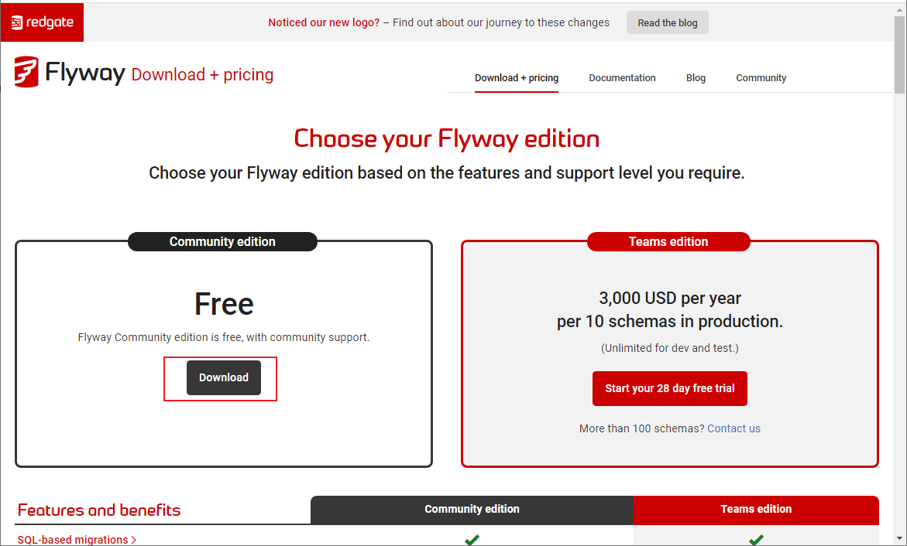
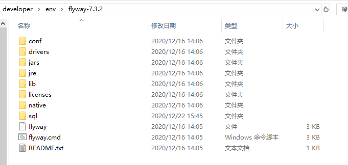
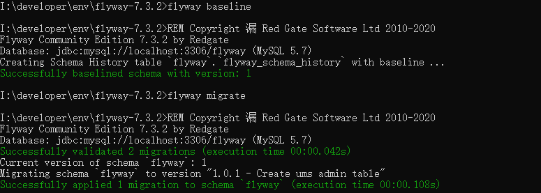
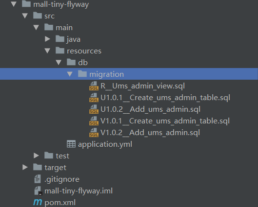
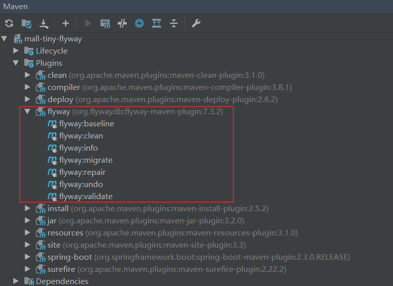

mall项目全套学习教程连载中，[关注公众号](#公众号)第一时间获取。

# 数据库迁移搞炸了！没用这款开源神器的锅？

> 当我们的应用升级时往往会伴随着数据库表结构的升级，此时就需要迁移数据库的表结构。一般我们会使用工具或者脚本来实现，手动操作毕竟有一定风险，要是能在应用启动时自动升级数据库表结构就好了！Flyway正是这么一款工具，通过Flyway和SpringBoot结合使用，在应用启动时就可以自动升级数据库表结构，非常方便，推荐给大家！

## Flyway简介

Flyway是一款数据库迁移工具，它让数据库迁移变得更加简单。它能像Git一样对数据库进行版本控制，支持命令行工具、Maven插件、第三方工具（比如SpringBoot）等多种使用方式。

Flyway具有如下特点：

- 简单：使用和学习简单，通过不同版本的SQL脚本实现数据库迁移。
- 专业：专注于数据库迁移功能，你无需担心有任何问题。
- 功能强大：支持多种数据库，拥有大量的第三方工具，支持CI/DI。

## 相关概念

### 工作原理

使用Flyway时我们需要编写好数据库迁移的SQL脚本，比如`	V1__Initial_Setup.sql`中初始化了三种表，`V2__First_Changes.sql`中又新增了两种表。Flyway会创建`flyway_schema_history`表，用于存储这些SQL脚本的执行情况，从而对数据库进行版本控制。当我们使用Flyway进行数据库迁移时，Flyway会根据`flyway_schema_history`表中的记录，自行决定需要执行哪些SQL脚本，从而实现数据库迁移。


### 脚本命名规范

在创建Flyway的SQL脚本时，有些命名规范需要遵守，这些命名规范决定了Flyway执行脚本的顺序和方式，可以先参考下面的示意图。


为了能被Flyway正确执行，SQL迁移脚本需要遵循如下规范：

- Prefix（前缀）：`V`表示有版本号的数据库迁移，`U`表示一些数据库版本的回滚，`R`表示可重复执行的数据库迁移；
- Version（版本号）：Flyway会按照版本号的大小顺序来执行数据库迁移脚本；
- Separator（分隔符）：命名时使用双下划线分隔符；
- Description（描述）：用于描述该迁移脚本的具体操作说明；
- Suffix（后缀）：表示`.sql`文件。

### 相关命令

- migrate：数据库迁移命令，会根据设置好的SQL脚本直接将数据库表升级至最新版本。
- clean：删除数据库中所有的表，千万别在生产环境上使用。
- info：打印所有关于数据库迁移的详细信息和状态信息。
- validate：验证数据库迁移是否可用。
- undo：对数据库迁移进行回滚操作。
- baseline：以现有数据库为基准，创建`flyway_schema_history`表，大于基准版本的数据库迁移才会被应用。
- repair：修复`flyway_schema_history`表。

## 命令行工具

> 使用Flyway实现数据迁移有多种方式，我们先通过命令行工具的方法来体验下Flyway的使用。

- 首先需要下载Flyway的命令行工具，下载社区版即可，下载地址：https://flywaydb.org/download




- 下载完成后进行解压，解压完成后目录结构如下；




- 修改Flyway的配置文件`/conf/flyway.conf`，修改下数据库配置即可；

```
flyway.url=jdbc:mysql://localhost:3306/flyway?useUnicode=true&characterEncoding=utf-8&serverTimezone=Asia/Shanghai 
flyway.user=root
flyway.password=root
```

- 在`/sql`目录下添加SQL执行脚本，这里添加创建`ums_admin`表的执行脚本`V1.0.1__Create_ums_admin_table.sql`；

```sql
CREATE TABLE `ums_admin`
(
  `id`          bigint(20) NOT NULL AUTO_INCREMENT,
  `username`    varchar(64)  DEFAULT NULL,
  `password`    varchar(64)  DEFAULT NULL,
  `icon`        varchar(500) DEFAULT NULL COMMENT '头像',
  `email`       varchar(100) DEFAULT NULL COMMENT '邮箱',
  `nick_name`   varchar(200) DEFAULT NULL COMMENT '昵称',
  `note`        varchar(500) DEFAULT NULL COMMENT '备注信息',
  `create_time` datetime     DEFAULT NULL COMMENT '创建时间',
  `login_time`  datetime     DEFAULT NULL COMMENT '最后登录时间',
  `status`      int(1)       DEFAULT '1' COMMENT '帐号启用状态：0->禁用；1->启用',
  PRIMARY KEY (`id`)
) ENGINE = InnoDB
  AUTO_INCREMENT = 8
  DEFAULT CHARSET = utf8 COMMENT ='后台用户表';
```

- 使用`flyway migrate`命令进行数据迁移，此时我们会发现需要先使用`flyway baseline`命令创建保存迁移记录的表`flyway_schema_history`才行；


- 先使用`flyway baseline`命令，再使用`flyway migrate`命令，命令行会输出执行成功的信息；




- 在`\sql`目录下添加SQL执行脚本，给`ums_admin`表添加一些数据，执行脚本为`V1.0.2__Add_ums_admin.sql`；

```sql
INSERT INTO ums_admin (username, PASSWORD, email, nick_name, STATUS)
VALUES ('test', '123456', 'test@qq.com', '测试账号', 1);
INSERT INTO ums_admin (username, PASSWORD, email, nick_name, STATUS)
VALUES ('macro', '123456', 'macro@qq.com', '普通账号', 1);
INSERT INTO ums_admin (username, PASSWORD, email, nick_name, STATUS)
VALUES ('andy', '123456', 'andy@qq.com', '普通账号', 1);
```

- 我们可以使用`flyway info`命令查看`flyway_schema_history`表中的数据迁移记录，可以发现`1.0.2`版本的更新还处于`Pending`状态，使用`flyway migrate`命令后变为`Success`；


- 我们可以创建可重复执行的SQL脚本，通常可以用来创建视图、存储过程、函数等，比如基于`ums_admin`表创建一个视图，执行脚本为`R__Ums_admin_view.sql`;

```sql
CREATE
  OR REPLACE VIEW ums_admin_view AS
SELECT username,
       PASSWORD,
       email
FROM ums_admin;
```

- 使用`flyway migrate`命令可以重复执行（当R开头的脚本有变更时），该脚本会在所有`V`开头的脚本执行完成后执行；


- Flyway的回滚机制需要依赖SQL脚本，这里创建`U1.0.1__Create_ums_admin_table.sql`和`U1.0.2__Add_ums_admin.sql`两个回滚脚本；

```sql
# U1.0.1__Create_ums_admin_table.sql
DROP TABLE ums_admin
```

```sql
# U1.0.2__Add_ums_admin.sql
DELETE FROM ums_admin;
```

- 使用`flyway undo`命令可以执行回滚，很遗憾的是社区版本不支持回滚，看样子数据库升级之前还是得通过工具做好备份才行！


## Maven插件

> Flyway也提供了Maven插件，插件所支持功能与命令行工具基本一致。

- 想要在Maven项目通过插件使用Flyway，首先需要在pom.xml中添加Flyway的插件并配置好数据库连接信息；

```xml
<!--Flyway的Maven插件-->
<plugin>
    <groupId>org.flywaydb</groupId>
    <artifactId>flyway-maven-plugin</artifactId>
    <version>7.3.2</version>
    <configuration>
        <url>jdbc:mysql://localhost:3306/flyway?serverTimezone=Asia/Shanghai</url>
        <user>root</user>
        <password>root</password>
    </configuration>
    <dependencies>
        <dependency>
            <groupId>mysql</groupId>
            <artifactId>mysql-connector-java</artifactId>
            <version>8.0.15</version>
        </dependency>
    </dependencies>
</plugin>
```

- 在resouce目录下创建`db\migration`目录，将数据库升级使用的SQL脚本放入进去；




- Flyway的Maven插件支持如下几种命令；




- 双击`flyway:info`命令使用，输出如下内容，此方式与命令行工具使用基本没啥区别。

```
[INFO] --- flyway-maven-plugin:7.3.2:info (default-cli) @ mall-tiny-flyway ---
[INFO] Flyway Community Edition 7.3.2 by Redgate
[INFO] Database: jdbc:mysql://localhost:3306/flyway (MySQL 5.7)
[INFO] Schema version: 1.0.2
[INFO] 
[INFO] +------------+---------+------------------------+----------+---------------------+----------+
| Category   | Version | Description            | Type     | Installed On        | State    |
+------------+---------+------------------------+----------+---------------------+----------+
|            | 1       | << Flyway Baseline >>  | BASELINE | 2020-12-24 11:17:35 | Baseline |
| Versioned  | 1.0.1   | Create ums admin table | SQL      | 2020-12-24 11:17:42 | Success  |
| Versioned  | 1.0.2   | Add ums admin          | SQL      | 2020-12-24 11:33:40 | Success  |
| Repeatable |         | Ums admin view         | SQL      | 2020-12-24 11:33:40 | Success  |
+------------+---------+------------------------+----------+---------------------+----------+

[INFO] ------------------------------------------------------------------------
[INFO] BUILD SUCCESS
[INFO] ------------------------------------------------------------------------
[INFO] Total time: 9.076 s
[INFO] Finished at: 2020-12-24T14:28:16+08:00
[INFO] Final Memory: 28M/286M
[INFO] ------------------------------------------------------------------------

Process finished with exit code 0
```

## 结合SpringBoot使用

> 由于SpringBoot官方已经支持了Flyway，所以Flyway结合SpringBoot使用非常简单！

- 首先在pom.xml中添加Flyway相关依赖，注意无需添加Flyway的版本号：

```xml
<!--Flyway相关依赖-->
<dependency>
    <groupId>org.flywaydb</groupId>
    <artifactId>flyway-core</artifactId>
</dependency>
```

- 修改配置文件`application.yml`，对数据源和Flyway进行配置；

```yaml
spring:
  datasource:
    url: jdbc:mysql://localhost:3306/flyway?useUnicode=true&characterEncoding=utf-8&serverTimezone=Asia/Shanghai
    username: root
    password: root
  flyway:
    # 启用Flyway功能
    enabled: true
    # 禁用Flyway的clean命令，使用clean命令会删除schema下的所有表
    clean-disabled: true
    # 设置Flyway的SQL脚本路径
    locations: classpath:db/migration
    # 设置版本信息控制表名称，默认flyway_schema_history
    table: flyway_schema_history
    # 在执行migrate命令时需要有flyway_schema_history表，通过baseline命令可以生成该表
    baseline-on-migrate: true
    # 指定baseline版本号，低于该版本的SQL脚本在migrate是不会执行
    baseline-version: 1
    # 设置字符编码
    encoding: UTF-8
    # 不允许不按顺序迁移
    out-of-order: false
    # 设置Flyway管控的schema，不设置的话为datasourcel.url中指定的schema
    schemas: flyway
    # 执行migrate时开启校验
    validate-on-migrate: true
```

- 最后直接运行SpringBoot应用，即可自动创建好对应的数据库，控制台会输出如下信息。

```
2020-12-24 14:38:15.659  INFO 10716 --- [           main] o.f.c.internal.license.VersionPrinter    : Flyway Community Edition 6.4.1 by Redgate
2020-12-24 14:38:15.898  INFO 10716 --- [           main] o.f.c.internal.database.DatabaseFactory  : Database: jdbc:mysql://localhost:3306/flyway (MySQL 5.7)
2020-12-24 14:38:15.972  INFO 10716 --- [           main] o.f.core.internal.command.DbValidate     : Successfully validated 3 migrations (execution time 00:00.047s)
2020-12-24 14:38:15.988  INFO 10716 --- [           main] o.f.c.i.s.JdbcTableSchemaHistory         : Creating Schema History table `flyway`.`flyway_schema_history` with baseline ...
2020-12-24 14:38:16.106  INFO 10716 --- [           main] o.f.core.internal.command.DbBaseline     : Successfully baselined schema with version: 1
2020-12-24 14:38:16.122  INFO 10716 --- [           main] o.f.core.internal.command.DbMigrate      : Current version of schema `flyway`: 1
2020-12-24 14:38:16.134  INFO 10716 --- [           main] o.f.core.internal.command.DbMigrate      : Migrating schema `flyway` to version 1.0.1 - Create ums admin table
2020-12-24 14:38:16.248  INFO 10716 --- [           main] o.f.core.internal.command.DbMigrate      : Migrating schema `flyway` to version 1.0.2 - Add ums admin
2020-12-24 14:38:16.281  INFO 10716 --- [           main] o.f.core.internal.command.DbMigrate      : Migrating schema `flyway` with repeatable migration Ums admin view
2020-12-24 14:38:16.314  INFO 10716 --- [           main] o.f.core.internal.command.DbMigrate      : Successfully applied 3 migrations to schema `flyway` (execution time 00:00.206s)
```

## 总结

对比手动升级数据库表结构，使用Flyway自动升级更有优势。使用Flyway可以在我们升级应用时同时升级数据库，由于社区版本目前不支持数据库回滚，升级前做好备份是很有必要的。

## 参考资料

官方文档：https://flywaydb.org/documentation/

## 项目源码地址

https://github.com/macrozheng/mall-learning/tree/master/mall-tiny-flyway

## 公众号


